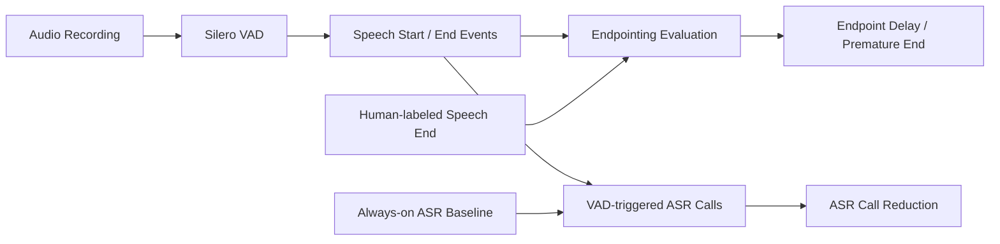

# Project 3 — Voice Activity Detection & Endpointing

A speech-processing experiment that uses **Silero Voice Activity Detection (VAD)** to detect when a person starts and stops speaking, evaluate endpointing accuracy against manually labeled speech endings, and measure how much VAD can reduce unnecessary ASR calls.

---

## 1. Project Objective

The objective of this project is to study how a Voice Activity Detection system can be used as a front-end for an Automatic Speech Recognition (ASR) system.

Instead of sending audio to ASR continuously, VAD can identify speech regions first and trigger ASR only when a speech segment is completed.

The project investigates three related questions:
1. How does Silero VAD detect speech start and speech end?
2. How does the minimum silence duration affect endpointing?
3. How many unnecessary ASR calls can be avoided by using VAD?

---

## 2. Pipeline



---

## 3. Key Concepts

### Voice Activity Detection (VAD)

VAD determines whether an audio signal contains speech. In this project, Silero VAD processes audio in small chunks and produces speech activity events.

### Endpointing

Endpointing determines when the speaker has finished their turn. In this project, a VAD `turn_end` event is treated as the detected end of a speech segment.

### Minimum Silence Duration

`min_silence_duration_ms` controls how much silence must be observed before VAD decides that the speaker has stopped talking.
The experiment tested:

* 100 ms
* 300 ms
* 500 ms

A shorter value can make the system respond faster, but may cause a speech segment to be ended too early when the speaker makes a short pause.

### Always-on ASR

The baseline assumes ASR is called continuously using fixed 0.5-second chunks.
For a 6-second recording: `6 / 0.5 = 12 ASR calls`
Therefore: `Always-on ASR calls = ceil(audio_duration / 0.5)`

### VAD-triggered ASR

With VAD-triggered ASR, ASR is called when a completed speech segment is detected.
Therefore: `VAD-triggered ASR calls = number of completed VAD speech segments`
This allows the experiment to compare continuous processing with speech-triggered processing.

---

## 4. Tools Used

* Python
* PyTorch
* Silero VAD
* NumPy
* Pandas
* SoundFile
* Librosa
* Matplotlib

---

## 5. Dataset Used

This experiment used three English speech recordings from the project corpus:

* `hamza_en_s01.wav`
* `hamza_en_s04.wav`
* `hamza_en_s05.wav`

Each recording is approximately 6 seconds long. The endpointing experiment also includes manually labeled speech-ending timestamps created by inspecting the waveform.

---

## 6. Project Structure

```text
project3-vad-endpointing/
│
├── recordings/
│   ├── hamza_en_s01.wav
│   ├── hamza_en_s04.wav
│   └── hamza_en_s05.wav
│
├── vad_test.py
├── label_endpoints.py
├── evaluate_endpointing.py
├── asr_call_comparison.py
│
├── human_endpoint_labels.csv
├── endpointing_results.csv
├── asr_call_comparison.csv
│
├── requirements.txt
├── README.md
└── .gitignore

```

---

## 7. Experiment 1 — VAD Event Detection

`vad_test.py` runs Silero VAD on the recordings using different silence-duration settings. The tested settings were: `100 ms`, `300 ms`, `500 ms`.
For each recording, the system records VAD speech-start and speech-end events.

### Observed events

**`hamza_en_s01.wav`**
All three silence settings produced:

```text
turn_start = 0.200 s
turn_end   = 3.600 s
turn_start = 5.200 s
turn_end   = 5.300 s

```

**`hamza_en_s04.wav`**
100 ms:

```text
turn_start = 0.100 s
turn_end   = 0.300 s
turn_start = 0.400 s
turn_end   = 5.500 s

```

300 ms and 500 ms:

```text
turn_start = 0.100 s
turn_end   = 5.500 s

```

**`hamza_en_s05.wav`**
100 ms:

```text
turn_start = 0.100 s
turn_end   = 0.300 s
turn_start = 0.500 s
turn_end   = 1.200 s
turn_start = 1.300 s
turn_end   = 4.600 s

```

300 ms and 500 ms:

```text
turn_start = 0.100 s
turn_end   = 4.600 s

```

*These observations show that the shorter 100 ms silence setting generated additional turn-end events in two recordings.*

---

## 8. Experiment 2 — Human Endpoint Evaluation

A manual endpoint labeling step was used to provide reference speech-ending timestamps. The human-labeled endpoints were:

| Recording | Human endpoint |
| --- | --- |
| `hamza_en_s01.wav` | 3.300730 s |
| `hamza_en_s04.wav` | 3.132534 s |
| `hamza_en_s05.wav` | 1.857784 s |

The evaluation script compares these human endpoints with the VAD endpoints. A VAD `turn_end` occurring *before* the human endpoint is counted as a premature endpoint. The *first* VAD endpoint occurring at or after the human endpoint is used as the final detected endpoint.

---

## 9. Endpointing Results

The experiment produced the following result:

| Minimum silence | Total premature endpoints |
| --- | --- |
| 100 ms | 3 |
| 300 ms | 0 |
| 500 ms | 0 |

The measured mean final endpoint delay was **1.802984 seconds** for all three tested silence settings. The same final delay occurred because the final post-human VAD endpoint was unchanged across the tested settings for these recordings.

---

## 10. Experiment 3 — Always-on vs VAD-triggered ASR

The third experiment compares the number of ASR calls required by:

* **Always-on ASR**: ASR is called every 0.5 seconds. Each 6-second recording therefore requires **12 ASR calls**.
* **VAD-triggered ASR**: ASR is called only after VAD detects a completed speech segment.

---

## 11. ASR Call Reduction Results

### Per-recording results

| Recording | Silence | Always-on | VAD-triggered | Calls saved | Reduction |
| --- | --- | --- | --- | --- | --- |
| s01 | 100 ms | 12 | 2 | 10 | 83.3% |
| s01 | 300 ms | 12 | 2 | 10 | 83.3% |
| s01 | 500 ms | 12 | 2 | 10 | 83.3% |
| s04 | 100 ms | 12 | 2 | 10 | 83.3% |
| s04 | 300 ms | 12 | 1 | 11 | 91.7% |
| s04 | 500 ms | 12 | 1 | 11 | 91.7% |
| s05 | 100 ms | 12 | 3 | 9 | 75.0% |
| s05 | 300 ms | 12 | 1 | 11 | 91.7% |
| s05 | 500 ms | 12 | 1 | 11 | 91.7% |

---

## 12. Overall ASR Call Reduction

Across all three recordings:

| Minimum silence | Always-on calls | VAD calls | Calls saved | Overall reduction |
| --- | --- | --- | --- | --- |
| 100 ms | 36 | 7 | 29 | 80.56% |
| 300 ms | 36 | 4 | 32 | 88.89% |
| 500 ms | 36 | 4 | 32 | 88.89% |

### Interpretation

On this test set:

* 100 ms produced 3 premature endpoints and reduced ASR calls by 80.56%.
* 300 ms produced 0 premature endpoints and reduced ASR calls by 88.89%.
* 500 ms also produced 0 premature endpoints and reduced ASR calls by 88.89%.

The experiment therefore demonstrates the trade-off between endpoint sensitivity and unnecessary segmentation. These results are specific to the three recordings used in this experiment and should not be treated as universal VAD performance.

---

## 13. Important Trade-off

The minimum silence duration affects both endpointing behavior and the number of ASR-trigger events. Conceptually:

**Short silence threshold**
↓ Faster endpoint detection
↓ Higher risk of ending a turn during a short pause
↓ More speech segments / ASR triggers

Whereas:

**Longer silence threshold**
↓ Wait longer before ending a turn
↓ Fewer premature endpoints in this experiment
↓ Potentially higher endpointing delay

*The correct setting depends on the application and should be evaluated using representative speech data.*

---

## 14. Generated Result Files

* **`human_endpoint_labels.csv`**: Contains the manually labeled speech-ending timestamps.
* **`endpointing_results.csv`**: Contains the endpointing evaluation results, including recording, silence duration, human endpoint, VAD endpoint, endpoint delay, and premature endpoint count.
* **`asr_call_comparison.csv`**: Contains the comparison between always-on ASR calls, VAD-triggered ASR calls, calls saved, and percentage reduction.

---

## 15. How to Run

Create and activate the virtual environment:

```bash
python -m venv venv
.\venv\Scripts\Activate.ps1

```

Install dependencies:

```bash
pip install -r requirements.txt

```

Run VAD detection:

```bash
python vad_test.py

```

Create or update manual endpoint labels:

```bash
python label_endpoints.py

```

Evaluate endpointing:

```bash
python evaluate_endpointing.py

```

Compare ASR call counts:

```bash
python asr_call_comparison.py

```

---

## 16. Key Takeaways

This project demonstrates three important ideas in speech systems:

1. **VAD is a front-end for speech recognition:** A speech-recognition system does not necessarily need to process every moment of incoming audio. VAD can identify when speech is present and help decide when to invoke ASR.
2. **Endpointing is a latency vs accuracy trade-off:** A very short silence threshold can produce premature turn endings. A longer threshold waits for stronger evidence that the speaker has finished.
3. **VAD can substantially reduce ASR triggering:** On the three recordings tested in this project, VAD reduced the number of ASR calls by 80.56% at 100 ms and 88.89% at 300 ms & 500 ms. *(These measurements are experimental results from this dataset, not general claims about Silero VAD).*

---

## 17. Limitations

The experiment has a small evaluation set of three recordings. Therefore:

* the measured endpoint behavior is not statistically representative of all speech;
* the ASR-call reduction depends on the structure and duration of the recordings;
* the tested silence thresholds do not cover every possible value;
* a larger hand-labeled evaluation set would provide stronger evidence.

Future experiments could evaluate more speakers, longer recordings, different speaking styles, and a wider range of silence thresholds.

---

## 18. Project Relation to Speech AI

The project demonstrates a practical component of a real-time speech pipeline:


VAD can therefore serve as an efficient front-end that determines when downstream speech recognition should be activated.

```
